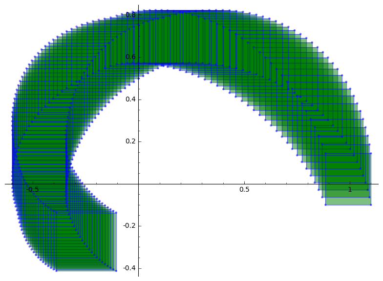

**WARNING: This project is under construction!**

## What is reachability?  

Reachability analysis consists, roughly speaking, in determining future (or past) trajectories of dynamical systems. We will work on the continuous-time setting, and with dynamical systems that are mathematically described by a set of ordinary differential equations. The reachability problem gets more interesting when we consider uncertainties, i.e. *when the systems are not deterministic*. This usually involves making one or more of these working assumptions:

(i) uncertainty in the initial states; 

(ii) uncertainty in the coefficients of the model; 

(iii) uncertainty in the inputs (e.g. noise). 

These assumptions lead to consider reachability flowpipes, which encompass an infinite number of trajectories, each single trajectory representing an admissible deterministic system (corresponding to the usual numeric solution of an ODE solver). 

The whole problem then translates to building reachability flowpipes with a reasonable balance between **complexity** (practically, the computational time under limited resources), and **accuracy** (practically, how good is the method for giving interesting answers).

## An example

Consider the linear system $\dot{x} = Ax + u$, for $A = \begin{pmatrix} -1 & -4 \\ 4 & -1 \end{pmatrix}$ and the input is in a ball of radius $\mu=0.1$ centered at the origin, $u \in \mathcal{B}_\infty(0, 0.1)$. Suppose we want to compute the reachable set for all initial conditions $x_0 \in \mathcal{X}_0 = \mathcal{B}_\infty(c, 0.1)$, for $c = (1,0)^T$. This is modelled as follows:

```python
# import main program
from src.lgg import compute_flowpipe, plot_flowpipe

# libraries for polyhedral manipulations
from lib.polyFunctions_core import BoxInfty

# system's coefficient matrix
A = matrix([[-1, -4], [4, -1]])

# input coefficient matrix
B = identity_matrix(2)

# input domain U
mu = 0.1
U = BoxInfty(center = [0,0], radius = mu)

# time horizon 
T = 1

# set initial condition 
X0 = BoxInfty(center = [1,0], radius = 0.1)

# set time discretization 
tau = 1e-2
```
Let's perform the reachability computation and plot the result (see Fig. above):

```python
# compute reachability flowpipe
fp = compute_flowpipe(A, X0, B, U, time_horizon = T, time_step = tau)

# plot the result
plot_flowpipe(fp)
```


## Why LGG?

LGG stands for the name of the authors, Colas Le Guernic and Antoine Girard, see [LGG09LIN](http://www.sciencedirect.com/science/article/pii/S1751570X09000387), [LGG09HY](http://link.springer.com/chapter/10.1007/978-3-642-02658-4_40), and references therein. The algorithm is based on support functions, and its scope is uncertain hybrid systems with piecewise linear dynamics. A convenient computational representation of reachability flowpipes is given by [convex polytopes](https://en.wikipedia.org/wiki/Convex_polytope), and for this reason these geometric objects play a central role in the problem considered.  

Moreover, LGG is one of the algorithms included in the [SpaceEx](http://spaceex.imag.fr/) state space explorer tool, which can be used for free at [http://spaceex.imag.fr/](http://spaceex.imag.fr/). 

## Is the method based on computer simulations?

No; in simulation-based methods, non-deterministic systems are studied by choosing a large sample of possible trajectories, admissible with the model (e.g. respecting the bounds in the initial states, the knowledge on the coefficients of the system, and the range of variation of the inputs). In contrast, **formal methods**, or guaranteed integration methods, aim to build suitable geometric objects that constitute an over-approximation of the set of reachable states for all admissible trajectories.

That said, computer programs do play a central role, since they allow to:

* Represent high-dimensional sets (e.g. polytopes).
* Make intermediate computations with polytopes, e.g. projections, convex hull, Minkowski addition, to mention some.
* Visualize the result of the algorithms (via 2D and 3D projections).
 

## What is the purpose of this project?

The aim of this project is two-fold: educational and for research.

First, it is an **educational** project in Applied Mathematics:

* As a motivational problem which connects Engineering and Control Systems with set-based methods in numerical analysis.
* To understand how does one of the algorithms in SpaceEx work.
* To learn about:
    * Manipulating polyhedra (e.g. convex sets, support functions, Hausdorff distance).
    * Random number generators.
    * Linear programming.	
    * Visualization (2d and 3d plots). 
    * Numerical computations with Numpy/Scipy.


Second, it can be useful for **research purposes**, since it is an economic implementation of one basic reachability algorithm, and more specifically: 

* To have a fast prototyping setup for reachability analysis problems, running benchmarks, etc.
* Because it can be easily modified for new purposes.
* To add SageMath to your own research toolbox, since it is a full-fledged scientific computing environment (and it is free software!).


## What can I learn in the *Tutorial*?

In the folder ```/tutorial```, you will find a set of Jupyter notebooks with a tutorial. It contains further explanations of the implementation in SageMath, some worked examples, and exercises. Some but not all mathematical developments are included; I recommend that you refer to the original papers for details.

## How to read the *Tutorial*?

The tutorial was designed in the collaborative mathematics platform SageMathCloud (SMC). It can also be run locally with SageMath + Jupyter notebook. Any of the notebooks (files with extension .ipynb) can be read with the [nbviewer](https://nbviewer.jupyter.org/), and searching for [this project](https://nbviewer.jupyter.org/github/mforets/LGG-Reachability-algorithm/tree/master/). 


